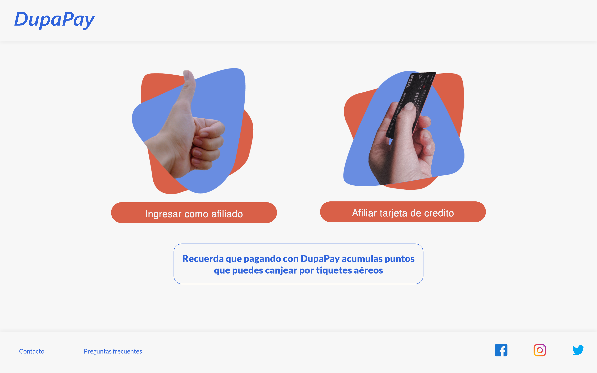
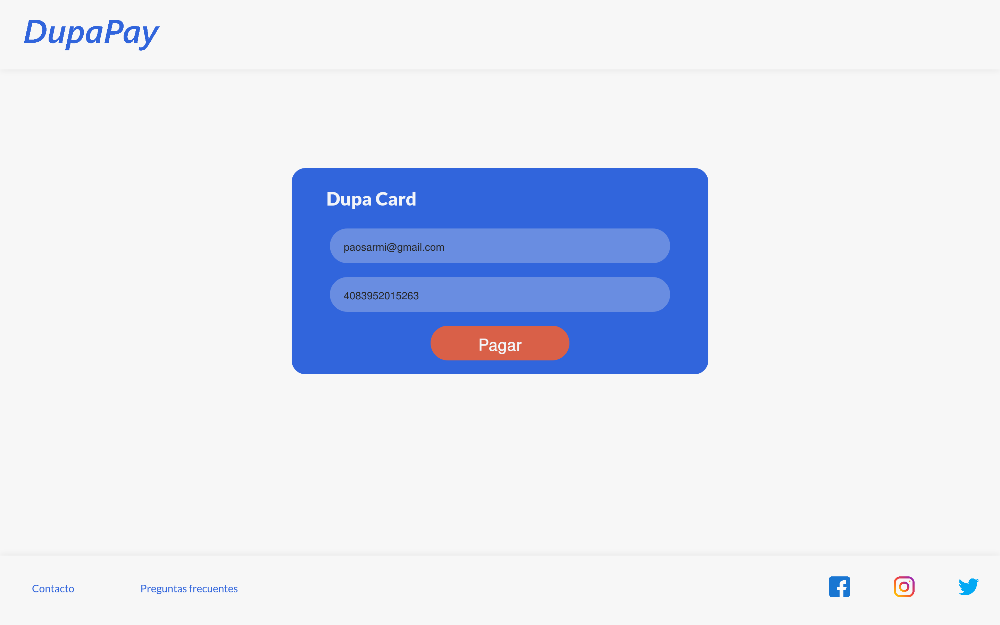
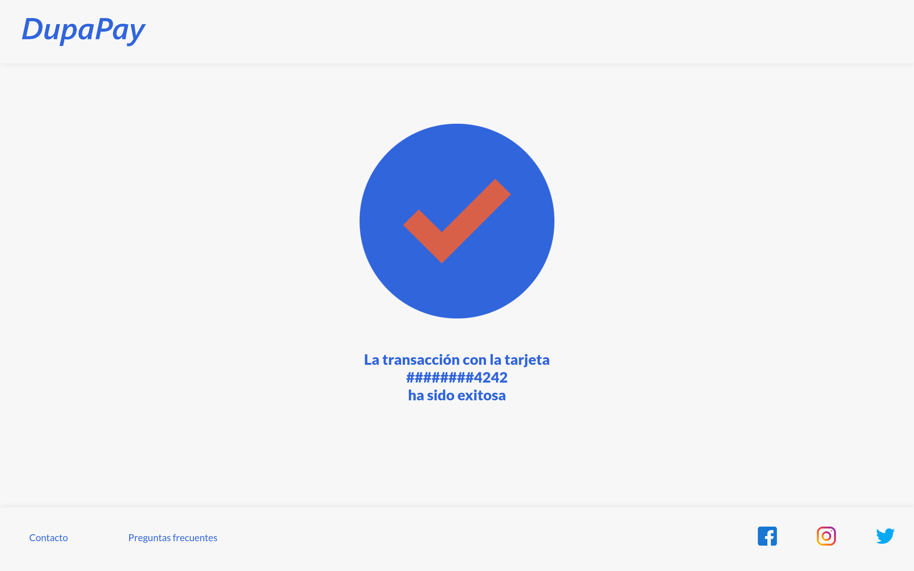
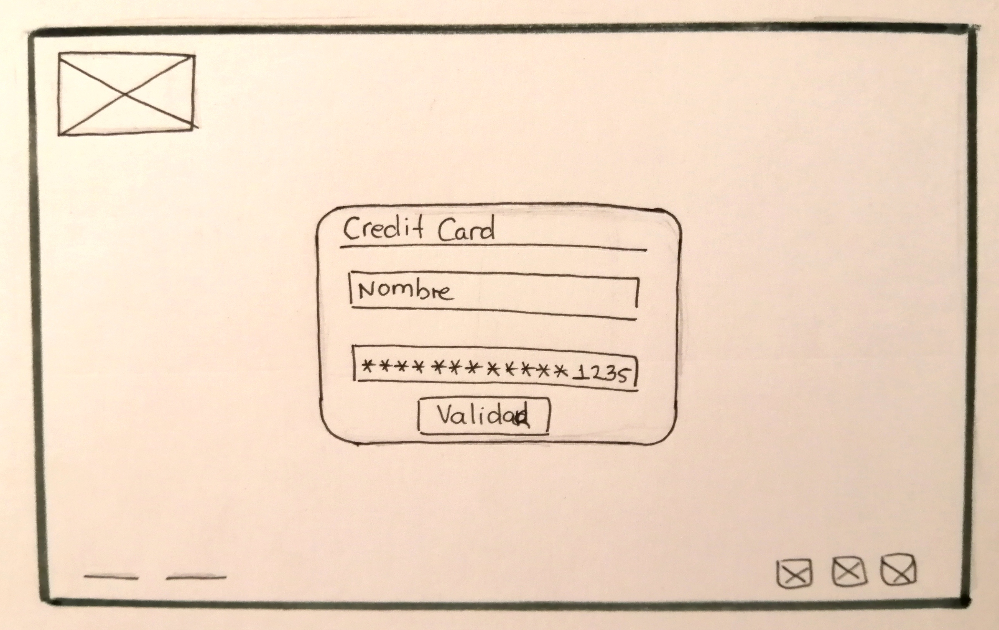
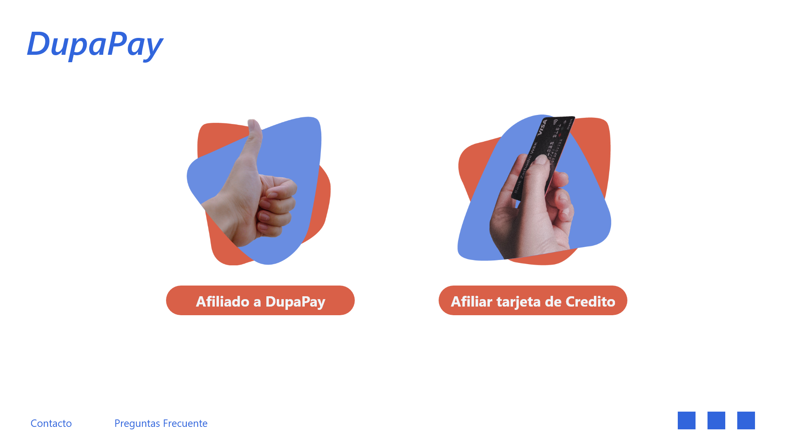
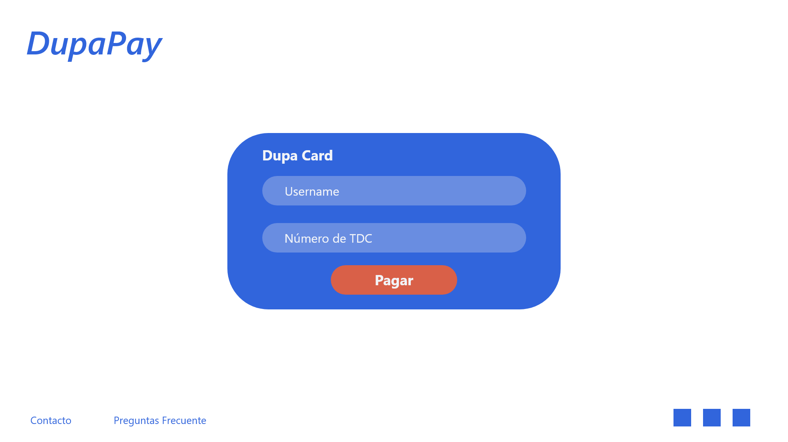
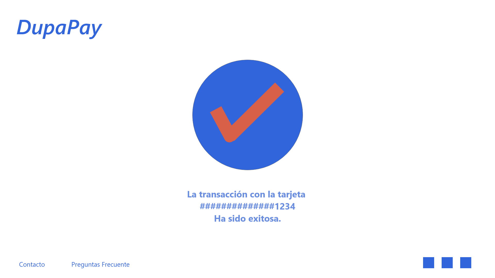

# DupaPay

## Índice

* [1. Descripción del proyecto](#1-descripción-del-proyecto)
* [2. Investigación UX](#2-investigación-ux)
* [3. Objetivos de aprendizaje](#3-objetivos-de-aprendizaje)

***

## 1. Descripción del proyecto

DupaPay es un sistema de pago con el cual acumulas puntos que puedes canjear por tiquetes aéreos. Debes tener tu tarjeta afiliada en nuestra plataforma, y una vez estés en tu tienda online favorita, escoge pagar con DupaPay y solo tendrás que ingresar tu correo afiliado y validar tu número de TDC y ya estarás acumulando puntos.

<figure>

<figcaption>Vista principal</figcaption>
</figure>

<figure>

<figcaption>Vista del formulario</figcaption>
</figure>

<figure>

<figcaption>Vista de tarjeta no valida</figcaption>
</figure>

<figure>

<figcaption>Vista de tarjeta valida</figcaption>
</figure>

<figure>

<figcaption>Vista de página no encontrada</figcaption>
</figure>

## 2. Investigación UX

### ¿Quiénes son los principales usuarios de producto?
 
Nuestros usuarios son personas entre 20 y 45 años, con un poder adquisitivo medio, con un estilo de vida que les permita hacer compras en línea y cuya pasión sea viajar y conocer lugares nuevos.

### ¿Cuáles son los objetivos de estos usuarios en relación con tu producto?
 
El objetivo de nuestro usuario es usar nuestro sistema de pago con frecuencia para así ganar tiquetes aéreos.

### ¿Cómo crees que el producto que estás creando está resolviendo sus problemas?
 
Nuestro producto le ofrece al usuario un sistema de pago rápido y seguro, que mediante su uso continuo le permite la posibilidad de cubrir su pasión por viajar.

<figure>

<figcaption>Primer Prototipo</figcaption>
</figure>

Con el feedback recibido mejoramos la distribución de los componentes y creamos nuevas vistas.

<figure>

<figcaption>Prototipo</figcaption>
</figure>

En nuevas iteraciones decidimos mejorar el flujo, el contraste y optimizar con la psicología de las formas para que nuestro producto refleje la seguridad que brindamos.
 
<figure>

<figcaption>Prototipo</figcaption>
</figure>

<figure>

<figcaption>Prototipo</figcaption>
</figure>

<figure>

<figcaption>Prototipo</figcaption>
</figure>

## 3. Objetivos de aprendizaje

Trabajando en parejas aprenderán a construir una aplicación web que interactuará
con lx usuarix final a través del navegador, utilizando HTML, CSS y JavaScript
como tecnologías.

Reflexiona y luego marca los objetivos que has llegado a **entender** y
**aplicar** en tu proyecto.

### UX

* [x] Diseñar la aplicación pensando y entendiendo al usuario
* [x] Crear prototipos para obtener feedback e iterar
* [x] Aplicar los principios de diseño visual

### HTML y CSS

* [ ] Uso correcto de HTML semántico
* [x] Uso de selectores de CSS
* [x] Construir tu aplicación respetando el diseño realizado (maquetación).

### DOM

* [x] Uso de selectores de nodos del DOM
* [x] Manejo de eventos del DOM
* [x] Manipulación dinámica del DOM

### Javascript

* [x] Manipulación de strings
* [x] Uso de condicionales
* [x] Uso de bucles
* [x] Uso de funciones
* [ ] Datos atómicos y estructurados
* [x] Utilizar ES Modules (`import` | `export`).

### Testing

* [x] [Testeo de tus funciones](https://jestjs.io/docs/es-ES/getting-started)

### Git y GitHub

* [x] Comandos de git (`add` | `commit` | `pull` | `status` | `push`).
* [x] Manejo de repositorios de GitHub (`clone` | `fork` | `gh-pages`).

### Buenas prácticas de desarrollo

* [x] Organizar y dividir el código en módulos (Modularización).
* [ ] Uso de identificadores descriptivos (Nomenclatura | Semántica).
* [ ] Uso de linter para seguir buenas prácticas (ESLINT).

